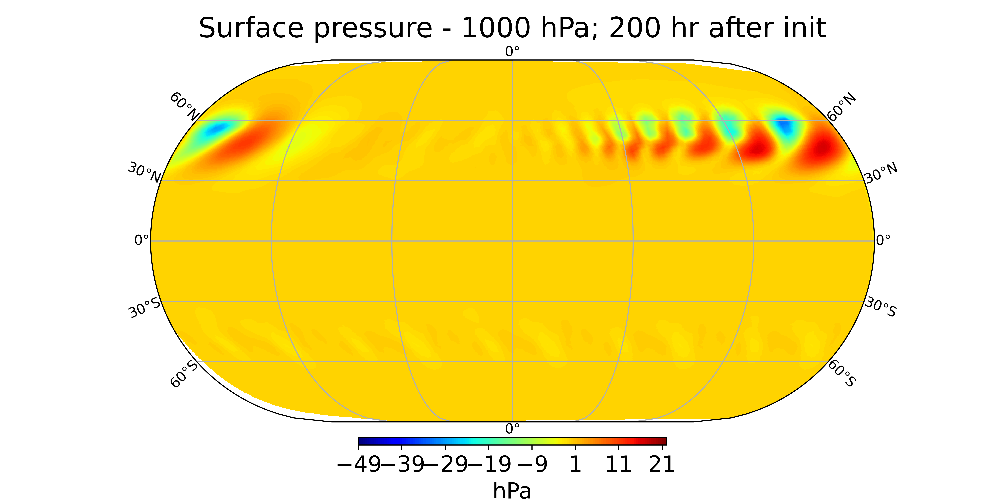

The General Geophysical Modeling Framework (GAME) is a global non-hydrostatic hexagonal C grid dynamical core with the possibility to advect a variable number of tracers. For radiation, it is coupled to RTE+RRTMGP via the C binding rte-rrtmgp-c (to be done).

*Perturbed JW test without diffusion after 200 h.*

View some more sample output [here](sample_visualizations).

## Overview

It is known that the forecast skill of a NWP model depends much more on physics and data assimilation than on the dynamical core. However, all global dynamical cores I know of have inconsistencies even in the most fundamental dynamical quantities (mass, energy forms and entropy). That is why the aim of this project is to develop a next generation global dynamical core with the following properties:

* Stability.
* The numerical dispersion relation shall contain no unphysical branches.
* The numerical dispersion relation shall contain all relevant physical branches, including a geostrophic mode.
* Strong scalability on massively parallel computer architectures.
* Mass conservation.
* Consistent local energy conversions with physical global integrals as a conseqeuence (especially energy conservation).
* Consistent local dissipation and entropy production, global satisfaction of the Second Law of Thermodynamics.
* No problems with terrain following coordinates. For example: A resting atmosphere around steep orography shall remain at rest.
* Absence of unphysical numerical stabilizers like divergence damping, fixers, filters and so on.
* Ellipsoidal grid geometry.
* A capable and flexible framework for coupling to physics and to other components of an Earth system model.
* Consistecy also in the presence of tracers and radiation.

According to my understanding, a hexagonal C grid is the only discretization where all this can be achieved.

### GAME's principles a.k.a. why a new global model is necessary

What GAME does what other models do not do and why:

* It uses the entropy as a prognostic variable. Usually, models use the potential temperature as a prognostic variable and modelers then call it the entropy, which is wrong. The potential temperature is a conserved quantity and therefore the only forcings are the diabatic forcings rendering it a suitable variable for modeling. However, the same is true for the real entropy (connected to the density times the logarithm of the potential temperature), and this last quantitiy is the much more fundamental physical property.
* It employs the modified TRSK scheme as well as the physically conistent dissipation proposed by Gassmann (2018).
* It assigns individual densities (instead of mixing ratios) to tracers as well as individual temperatures and sink velocities.

What GAME does not do and why:

* It does not sacrifice physical consistency for a bit of speed up and tuning possibilities, like ICON-DWD does.
* It does not contain an option for calculations in 2D, on the plane, in vertical columns or any other purely academic features. If schemes need to be tested individually, it can be done in an individual Python code.
* It does not contain a nesting option. There are basically two ways this could be done: 1.) The MPAS way, where smooth transitions between coarser and finer mesh regions are possible, minimizing numerical noise. However, the global time step is bound by the smallest grid distance, which is unefficicent in coarser mesh regions. 2.) The ICON-DWD way, where a two-step nesting option exists and a smaller time step can be used only in the finer domain. This, however, leads to numerical noise. In my view one should use a global model with a uniform resolution and then simply regional models in specific areas.

Things to be done:

* A 3D implicit solver for efficiency and better energy conservation properties.
* A way to construct Voronoi meshes on an ellipsoid.
* (How) can EPV be conserved?

## Documents

The documentation can be found in the subdirectory doc. It contains an overview of numerics and references to the literature as well as a description of the code.

The handbook of the model can be found in the subdirectory handbook. It contains information on how to generate necessary files like grid files and input data and explains how to compile, configure and run the model.

## Prerequisites

* [geos95](https://github.com/MHBalsmeier/geos95)
* netcdf library
* eccodes library (installation manual: https://mhbalsmeier.github.io/tutorials/eccodes_on_ubuntu.html)
* CMake
* [atmostracers](https://github.com/MHBalsmeier/atmostracers)
* [rte-rrtmgp-c](https://github.com/MHBalsmeier/rte-rrtmgp-c)
* Python (only for the plotting routines, which are of course not part of the actual model)
* OpenMPI (not yet)

## Installing the model

It is recommended to run the model on Linux.

### Download

	git clone https://github.com/MHBalsmeier/game.git
	./setup_build_directories.sh

### Build and install

In the shell scripts controlling the build process (residing in the directory build\_scripts) change the variable aim\_dir to a place of your choice, then run the scripts. The files with the suffix \_dev are meant to install to a location where new versions can be tested. You also need to install the run configs in order to have the run scripts of the model where they belong. Install the plotting routines if you want to make use of them.

## Fundamental literature

* Staniforth, A. and Thuburn, J. (2012), Horizontal grids for global weather and climate prediction models: a review. Q.J.R. Meteorol. Soc., 138: 1-26. doi:10.1002/qj.958
* Weller, H., J. Thuburn, and C. J. Cotter, 2012: Computational Modes and Grid Imprinting on Five Quasi-Uniform Spherical C Grids. Mon. Wea. Rev., 140, 2734–2755, https://doi.org/10.1175/MWR-D-11-00193.1.
* Gassmann, Almut & Herzog, Hans-Joachim. (2008). Towards a consistent numerical compressible non‐hydrostatic model using generalized Hamiltonian tools. Quarterly Journal of the Royal Meteorological Society. 134. 1597 - 1613. 10.1002/qj.297.
* Thuburn, John et al. “Numerical representation of geostrophic modes on arbitrarily structured C-grids.” J. Comput. Phys. 228 (2009): 8321-8335.
* Ringler, Todd & Thuburn, John & Klemp, J. & Skamarock, W.C.. (2010). A unified approach to energy conservation and potential vorticity dynamics on arbitrarily structured C-grids. J. Comput. Physics. 229. 3065-3090. 10.1016/j.jcp.2009.12.007.
* Gassmann, A. (2013), A global hexagonal C‐grid non‐hydrostatic dynamical core (ICON‐IAP) designed for energetic consistency. Q.J.R. Meteorol. Soc., 139: 152-175. doi:10.1002/qj.1960
* Gassmann, A. Discretization of generalized Coriolis and friction terms on the deformed hexagonal C‐grid. Q J RMeteorol Soc. 2018; 144: 2038– 2053. https://doi.org/10.1002/qj.3294

